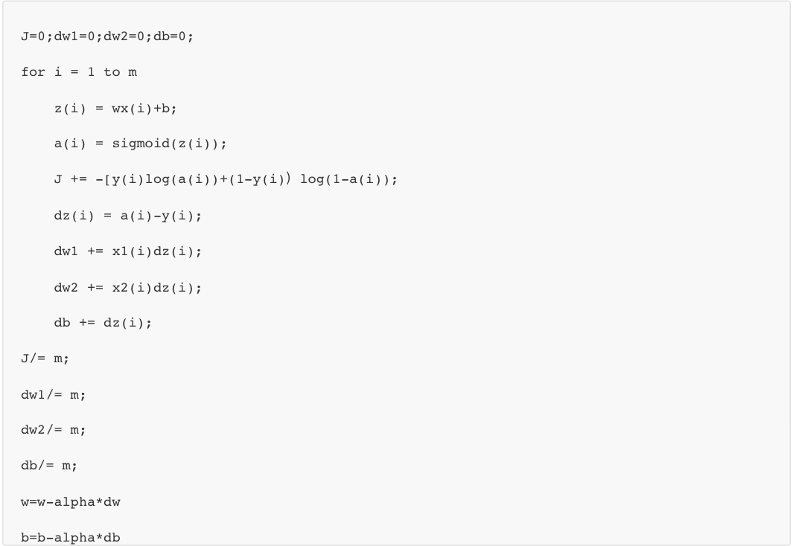

# 第一门课 神经网络和深度学习

## 第一周：深度学习引言(Introduction to Deep Learning)

### 课程概述

在第一门课程中，你将学习如何建立神经网络（包含一个深度神经网络），以及如何在数据上面训练他们。在这门课程的结尾，你将用一个深度神经网络进行辨认猫。

在第二门课中，我们将使用三周时间。你将进行深度学习方面的实践，学习严密地构建神经网络，如何真正让它表现良好，因此你将要学习超参数调整、正则化、诊断偏差和方差以及一些高级优化算法，比如**Momentum**和**Adam**算法，犹如黑魔法一样根据你建立网络的方式。

在第三门课中，我们将使用两周时间来学习如何结构化你的机器学习工程。事实证明，构建机器学习系统的策略改变了深度学习的错误。

在第四门课程中，我们将会提到卷积神经网络(**CNN(s)**)，它经常被用于图像领域，你将会在第四门课程中学到如何搭建这样的模型。

最后在第五门课中，你将会学习到序列模型，以及如何将它们应用于自然语言处理，以及其它问题。序列模型包括的模型有循环神经网络（**RNN**）、全称是长短期记忆网络（**LSTM**）。你将在课程五中了解其中的时期是什么含义，并且有能力应用到自然语言处理（**NLP**）问题。

### 神经网络

神经网络方面的一个巨大突破是从**sigmoid**函数转换到一个**ReLU**函数

使用**sigmoid**函数和机器学习使sigmoid函数的梯度会接近零，所以学习的速度会变得非常缓慢，因为当你实现梯度下降以及梯度接近零的时候，参数会更新的很慢，所以学习的速率也会变的很慢。

通过改变激活函数，即换用这一个函数，叫做**ReLU**的函数（修正线性单元**Rectified Linear Unit**）。

**ReLU**它的梯度对于所有输入的负值都是零，因此梯度更加不会趋向逐渐减少到零。而这里的梯度，这条线的斜率在这左边是零，仅仅通过将**Sigmod**函数转换成**ReLU**函数，便能够使得一个叫做梯度下降（**gradient descent**）的算法运行的更快。

### 深度学习兴起

深度学习的性能随着数量的提升而不断提升直至接近稳定，数字化社会的来临使得我们可以获得大量数据远超过机器学习算法能够高效发挥它们优势的规模，导致深度学习的快速发展。

如今最可靠的方法来在神经网络上获得更好的性能，往往就是**要么训练一个更大的神经网络，要么投入更多的数据**，但这只能在一定程度上起作用。

## 第二周：神经网络的编程基础(Basics of Neural Network programming)

### 使用逻辑回归解决二分类问题

<!--逻辑回归可以看做是一个非常小的神经网络-->

假如你有一张图片作为输入，比如这只猫，如果识别这张图片为猫，则输出标签1作为结果；如果识别出不是猫，那么输出标签0作为结果。现在我们可以用字母y来表示输出的结果标签,即 y=0 or1？

图片在计算机的表示：

 

保存一张图片，需要保存三个矩阵，它们分别对应图片中的红、绿、蓝三种颜色通道，如果你的图片大小为64x64像素，那么你就有三个规模为64x64的矩阵，分别对应图片中红、绿、蓝三种像素的强度值。图中的规模为5x4 而不是64x64。

定义一个特征向量x来表示这张图片：

把所有的像素都取出来，例如255、231等等，直到取完所有的红色像素，接着最后是255、134、…、255、134等等，直到得到一个特征向量，把图片中所有的红、绿、蓝像素值都列出来。

如果图片的大小为64x64像素，那么向量 的总维度，将是64乘以64乘以3，这是三个像素矩阵中像素的总量。在这个例子中结果为12,288。现在我们用，12,288来表示输入特征向量的维度。

此时的问题为：

如果X1（一个nx维的向量）是我们在上个视频看到的图片，你想让y^来告诉你这是一只猫的图片的机率有多大。

用w、b来表示逻辑回归的参数，则该问题可以尝试却不可行的函数为

但由该函数得到的值可能远大于1，也可能是负值，因此逻辑回归中把这个函数所得值z作为sigmoid函数的自变量。

sigmoid函数：

其图像为：

此时保证了预测得到的值只能在0～1之间。

参数可理解为：

在某些例子里，你定义一个额外的特征称之为x0，并且使它等于1，那么现在X1就是一个nx加1维的变量，然后定义假设函数为：

参数向量包含：𝞱0、𝞱1...𝞱n，此时的𝞱0充当了b，剩下的𝞱1...𝞱n即充当了w，注意参数维度为(nx+1)x1。

完整的逻辑回归的假设函数：

为了训练逻辑回归模型的参数b和参数w，我们需要一个代价函数J，通过训练代价函数来得到参数。

用y^表示模型的预测值，希望它会接近于训练集中的y值。

损失函数又叫做误差函数，用来衡量算法的运行情况，Loss function: 

在逻辑回归中用到的损失函数是：

损失函数是在单个训练样本中定义的，它衡量的是算法在单个训练样本中表现如何。

为了衡量算法在全部训练样本上的表现如何，需要定义一个算法的代价函数

训练逻辑回归模型时候，我们需要找到合适的w和b，来让代价函数J的总代价降到最低。 

通过最小化代价函数来得到参数：

𝝰表示学习率（**learning rate**），用来控制步长（**step**）。

### 向量化实现算法

非向量实现逻辑：如果有多个特征，还需要遍历特征数来获得dwi

向量实现逻辑回归

### Python 中的广播（Broadcasting in Python）

**numpy**广播机制：如果两个数组的后缘维度的轴长度相符或其中一方的轴长度为1，则认为它们是广播兼容的。广播会在缺失维度和轴长度为1的维度上进行。

1⃣️矩阵 Amxn和矩阵B1xn 进行四则运算，后缘维度轴长度相符，可以广播，广播沿着轴长度为1的轴进行，B的每行会复制m遍使其成Bmxn，之后做逐元素四则运算。

2⃣️矩阵 Amxn和矩阵Bnx1 进行四则运算，后缘维度轴长度不相符，可以广播，广播沿着轴长度为1的轴进行，B的每列会复制n遍使其成Bmxn，之后做逐元素四则运算。

3⃣️矩阵Amx1和常数进行四则运算，后缘维度轴长度不相符，可以广播，广播沿着轴长度为1的轴进行，常数每行复制m遍使其成Bmx1，之后做逐元素四则运算。

4⃣️矩阵A1xn和常数进行四则运算，后缘维度轴长度不相符，可以广播，广播沿着轴长度为1的轴进行，常数每列复制n遍使其成B1xn，之后做逐元素四则运算。

## 第三周：浅层神经网络(Shallow neural networks)

### 神经网络的表示（Neural Network Representation）

输入特征x1，x2，x3被竖直地堆叠起来，组成神经网络的**输入层**

输入层后面是隐藏层

最后一层只由一个结点构成，被称为**输出层**

计算网络的层数时，输入层是不算入总层数内，所以此处隐藏层是第一层，输出层是第二层。

【注：我们将输入层称为第零层。】

### 计算一个神经网络的输出（Computing a Neural Network's output）

其中，x表示输入特征，a表示每个神经元的输出，w表示特征的权重，上标表示神经网络的层数（隐藏层为1），下标表示该层的第几个神经元。这是神经网络的**符号惯例**。

类似于逻辑回归，神经网络只是重复多次逻辑回归的运算：首先计算出z，然后在第二步中你以**sigmoid**函数为激活函数计算z

因此从该例子中得到该隐藏层的激活值如下：

用向量化表示：

得到激活值a为：

同理在输出层也只是在计算一次公式：

【注意】

在用向量化计算隐藏层时，参数w的维度为4x3，4对应隐藏层的神经元个数，3对应于输入层的特征分数；而b则为4x1，4对应隐藏层的神经元个数，得到一个4x1的输出a。

在用向量化计算输出层时，参数w的维度为1x4，1对应输出层的神经元个数，4对应于隐藏层的神经元个数；而b则为1x1，1对应输出层的神经元个数，得到一个1x1的输出a。

### 多样本向量化（Vectorizing across multiple examples）

以上使用单一的训练样本，在神经网络上计算出预测值。

现在向量化多个训练样本，并计算出结果。

非向量化形式的实现：需要让i从1到m实现这四个等式：

向量化实现：通过将每个值横向排列形成矩阵

输入层：

隐藏层：

​	输入：

​	得到的激活值：

输出层同理。

将多个训练样本横向堆叠成一个矩阵，然后就可以推导出神经网络中前向传播（**forward propagation**）部分的向量化实现。

【注意】按列堆叠是重点。

### 激活函数（Activation functions）

**tanh**函数或者双曲正切函数是总体上都优于**sigmoid**函数的激活函数。

【例外】：在二分类的问题中，对于输出层，因为预测值需要是是0或1，所以想让的数值介于0和1之间，而不是在-1和+1之间。所以需要使用**sigmoid**激活函数。

**sigmoid**函数和**tanh**函数两者共同的缺点是，在z特别大或者特别小的情况下，导数的梯度或者函数的斜率会变得特别小，最后就会接近于0，导致降低梯度下降的速度。

🌟机器学习另一个很流行的函数：修正线性单元的函数（**ReLu**）

公式为：

只要z是正值的情况下，导数恒等于1，当是负值的时候，导数恒等于0。

如果输出是0、1值（二分类问题），则输出层选择**sigmoid**函数，然后其它的所有单元都选择**Relu**函数。

另一个版本的**Relu**被称为**Leaky Relu**。

当是负值时，这个函数的值不是等于0，而是轻微的倾斜，如图。

这个函数通常比**Relu**激活函数效果要好，尽管在实际中**Leaky ReLu**使用的并不多。

【总结】：

**sigmoid**激活函数：除了输出层是一个二分类问题基本不会用它。

**tanh**激活函数：**tanh**是非常优秀的，几乎适合所有场合。

**ReLu**激活函数：最常用的默认函数，，如果不确定用哪个激活函数，就使用**ReLu**或者**Leaky ReLu**。

### 为什么需要非线性激活函数？（why need a nonlinear activation function?）

如果你使用线性激活函数或者没有使用一个激活函数，那么无论你的神经网络有多少层一直在做的只是计算线性函数，所以不如直接去掉全部隐藏层。

如果在隐藏层用线性激活函数，在输出层用**sigmoid**函数，那么这个模型的复杂度和没有任何隐藏层的标准**Logistic**回归是一样的。

### 激活函数的导数（Derivatives of activation functions）

1.sigmoid function

求导如下：

因此：

2.**Tanh activation function**

公式：

求导：

因此：

3.**Rectified Linear Unit (ReLU)**

求导：

​	需要在z= 0的时候给定其导数1,0

4.**Leaky linear unit (Leaky ReLU)**

​	需要在z= 0的时候给定其导数1,0

### 神经网络的梯度下降（Gradient descent for neural networks）

正向传播方程如下：

反向传播方程如下:

## 第四周：深层神经网络(Deep Neural Networks)

**DLI**（深度学习学院 **deep learning institute**）已经意识到有一些函数，只有非常深的神经网络能学会，而更浅的模型则办不到。尽管对于任何给定的问题很难去提前预测到底需要多深的神经网络，所以先去尝试逻辑回归，尝试一层然后两层隐含层，然后把隐含层的数量看做是另一个可以自由选择大小的超参数，然后再保留交叉验证数据上评估，或者用你的开发集来评估。

深层神经网络就是隐藏层数较多。

前向传播：

输入X，也记为A0

# 第一门课 神经网络和深度学习

## 第一周：深度学习引言(Introduction to Deep Learning)

### 课程概述

在第一门课程中，你将学习如何建立神经网络（包含一个深度神经网络），以及如何在数据上面训练他们。在这门课程的结尾，你将用一个深度神经网络进行辨认猫。

在第二门课中，我们将使用三周时间。你将进行深度学习方面的实践，学习严密地构建神经网络，如何真正让它表现良好，因此你将要学习超参数调整、正则化、诊断偏差和方差以及一些高级优化算法，比如**Momentum**和**Adam**算法，犹如黑魔法一样根据你建立网络的方式。

在第三门课中，我们将使用两周时间来学习如何结构化你的机器学习工程。事实证明，构建机器学习系统的策略改变了深度学习的错误。

在第四门课程中，我们将会提到卷积神经网络(**CNN(s)**)，它经常被用于图像领域，你将会在第四门课程中学到如何搭建这样的模型。

最后在第五门课中，你将会学习到序列模型，以及如何将它们应用于自然语言处理，以及其它问题。序列模型包括的模型有循环神经网络（**RNN**）、全称是长短期记忆网络（**LSTM**）。你将在课程五中了解其中的时期是什么含义，并且有能力应用到自然语言处理（**NLP**）问题。

### 神经网络

神经网络方面的一个巨大突破是从**sigmoid**函数转换到一个**ReLU**函数

使用**sigmoid**函数和机器学习使sigmoid函数的梯度会接近零，所以学习的速度会变得非常缓慢，因为当你实现梯度下降以及梯度接近零的时候，参数会更新的很慢，所以学习的速率也会变的很慢。

通过改变激活函数，即换用这一个函数，叫做**ReLU**的函数（修正线性单元**Rectified Linear Unit**）。

**ReLU**它的梯度对于所有输入的负值都是零，因此梯度更加不会趋向逐渐减少到零。而这里的梯度，这条线的斜率在这左边是零，仅仅通过将**Sigmod**函数转换成**ReLU**函数，便能够使得一个叫做梯度下降（**gradient descent**）的算法运行的更快。

### 深度学习兴起

深度学习的性能随着数量的提升而不断提升直至接近稳定，数字化社会的来临使得我们可以获得大量数据远超过机器学习算法能够高效发挥它们优势的规模，导致深度学习的快速发展。

如今最可靠的方法来在神经网络上获得更好的性能，往往就是**要么训练一个更大的神经网络，要么投入更多的数据**，但这只能在一定程度上起作用。

## 第二周：神经网络的编程基础(Basics of Neural Network programming)

### 使用逻辑回归解决二分类问题

<!--逻辑回归可以看做是一个非常小的神经网络-->

假如你有一张图片作为输入，比如这只猫，如果识别这张图片为猫，则输出标签1作为结果；如果识别出不是猫，那么输出标签0作为结果。现在我们可以用字母y来表示输出的结果标签,即 y=0 or1？

图片在计算机的表示：

 

保存一张图片，需要保存三个矩阵，它们分别对应图片中的红、绿、蓝三种颜色通道，如果你的图片大小为64x64像素，那么你就有三个规模为64x64的矩阵，分别对应图片中红、绿、蓝三种像素的强度值。图中的规模为5x4 而不是64x64。

定义一个特征向量x来表示这张图片：

把所有的像素都取出来，例如255、231等等，直到取完所有的红色像素，接着最后是255、134、…、255、134等等，直到得到一个特征向量，把图片中所有的红、绿、蓝像素值都列出来。

如果图片的大小为64x64像素，那么向量 的总维度，将是64乘以64乘以3，这是三个像素矩阵中像素的总量。在这个例子中结果为12,288。现在我们用，12,288来表示输入特征向量的维度。

此时的问题为：

如果X1（一个nx维的向量）是我们在上个视频看到的图片，你想让y^来告诉你这是一只猫的图片的机率有多大。

用w、b来表示逻辑回归的参数，则该问题可以尝试却不可行的函数为

但由该函数得到的值可能远大于1，也可能是负值，因此逻辑回归中把这个函数所得值z作为sigmoid函数的自变量。

sigmoid函数：

其图像为：

此时保证了预测得到的值只能在0～1之间。

参数可理解为：

在某些例子里，你定义一个额外的特征称之为x0，并且使它等于1，那么现在X1就是一个nx加1维的变量，然后定义假设函数为：

参数向量包含：𝞱0、𝞱1...𝞱n，此时的𝞱0充当了b，剩下的𝞱1...𝞱n即充当了w，注意参数维度为(nx+1)x1。

完整的逻辑回归的假设函数：

为了训练逻辑回归模型的参数b和参数w，我们需要一个代价函数J，通过训练代价函数来得到参数。

用y^表示模型的预测值，希望它会接近于训练集中的y值。

损失函数又叫做误差函数，用来衡量算法的运行情况，Loss function: 

在逻辑回归中用到的损失函数是：

损失函数是在单个训练样本中定义的，它衡量的是算法在单个训练样本中表现如何。

为了衡量算法在全部训练样本上的表现如何，需要定义一个算法的代价函数

训练逻辑回归模型时候，我们需要找到合适的w和b，来让代价函数J的总代价降到最低。 

通过最小化代价函数来得到参数：

𝝰表示学习率（**learning rate**），用来控制步长（**step**）。

### 向量化实现算法

非向量实现逻辑：如果有多个特征，还需要遍历特征数来获得dwi

向量实现逻辑回归

### Python 中的广播（Broadcasting in Python）

**numpy**广播机制：如果两个数组的后缘维度的轴长度相符或其中一方的轴长度为1，则认为它们是广播兼容的。广播会在缺失维度和轴长度为1的维度上进行。

1⃣️矩阵 Amxn和矩阵B1xn 进行四则运算，后缘维度轴长度相符，可以广播，广播沿着轴长度为1的轴进行，B的每行会复制m遍使其成Bmxn，之后做逐元素四则运算。

2⃣️矩阵 Amxn和矩阵Bnx1 进行四则运算，后缘维度轴长度不相符，可以广播，广播沿着轴长度为1的轴进行，B的每列会复制n遍使其成Bmxn，之后做逐元素四则运算。

3⃣️矩阵Amx1和常数进行四则运算，后缘维度轴长度不相符，可以广播，广播沿着轴长度为1的轴进行，常数每行复制m遍使其成Bmx1，之后做逐元素四则运算。

4⃣️矩阵A1xn和常数进行四则运算，后缘维度轴长度不相符，可以广播，广播沿着轴长度为1的轴进行，常数每列复制n遍使其成B1xn，之后做逐元素四则运算。

## 第三周：浅层神经网络(Shallow neural networks)

### 神经网络的表示（Neural Network Representation）

输入特征x1，x2，x3被竖直地堆叠起来，组成神经网络的**输入层**

输入层后面是隐藏层

最后一层只由一个结点构成，被称为**输出层**

计算网络的层数时，输入层是不算入总层数内，所以此处隐藏层是第一层，输出层是第二层。

【注：我们将输入层称为第零层。】

### 计算一个神经网络的输出（Computing a Neural Network's output）

其中，x表示输入特征，a表示每个神经元的输出，w表示特征的权重，上标表示神经网络的层数（隐藏层为1），下标表示该层的第几个神经元。这是神经网络的**符号惯例**。

类似于逻辑回归，神经网络只是重复多次逻辑回归的运算：首先计算出z，然后在第二步中你以**sigmoid**函数为激活函数计算z

因此从该例子中得到该隐藏层的激活值如下：

用向量化表示：

得到激活值a为：

同理在输出层也只是在计算一次公式：

【注意】

在用向量化计算隐藏层时，参数w的维度为4x3，4对应隐藏层的神经元个数，3对应于输入层的特征分数；而b则为4x1，4对应隐藏层的神经元个数，得到一个4x1的输出a。

在用向量化计算输出层时，参数w的维度为1x4，1对应输出层的神经元个数，4对应于隐藏层的神经元个数；而b则为1x1，1对应输出层的神经元个数，得到一个1x1的输出a。

### 多样本向量化（Vectorizing across multiple examples）

以上使用单一的训练样本，在神经网络上计算出预测值。

现在向量化多个训练样本，并计算出结果。

非向量化形式的实现：需要让i从1到m实现这四个等式：

向量化实现：通过将每个值横向排列形成矩阵

输入层：

隐藏层：

​	输入：

​	得到的激活值：

输出层同理。

将多个训练样本横向堆叠成一个矩阵，然后就可以推导出神经网络中前向传播（**forward propagation**）部分的向量化实现。

【注意】按列堆叠是重点。

### 激活函数（Activation functions）

**tanh**函数或者双曲正切函数是总体上都优于**sigmoid**函数的激活函数。

【例外】：在二分类的问题中，对于输出层，因为预测值需要是是0或1，所以想让的数值介于0和1之间，而不是在-1和+1之间。所以需要使用**sigmoid**激活函数。

**sigmoid**函数和**tanh**函数两者共同的缺点是，在z特别大或者特别小的情况下，导数的梯度或者函数的斜率会变得特别小，最后就会接近于0，导致降低梯度下降的速度。

🌟机器学习另一个很流行的函数：修正线性单元的函数（**ReLu**）

公式为：

只要z是正值的情况下，导数恒等于1，当是负值的时候，导数恒等于0。

如果输出是0、1值（二分类问题），则输出层选择**sigmoid**函数，然后其它的所有单元都选择**Relu**函数。

另一个版本的**Relu**被称为**Leaky Relu**。

当是负值时，这个函数的值不是等于0，而是轻微的倾斜，如图。

这个函数通常比**Relu**激活函数效果要好，尽管在实际中**Leaky ReLu**使用的并不多。

【总结】：

**sigmoid**激活函数：除了输出层是一个二分类问题基本不会用它。

**tanh**激活函数：**tanh**是非常优秀的，几乎适合所有场合。

**ReLu**激活函数：最常用的默认函数，，如果不确定用哪个激活函数，就使用**ReLu**或者**Leaky ReLu**。

### 为什么需要非线性激活函数？（why need a nonlinear activation function?）

如果你使用线性激活函数或者没有使用一个激活函数，那么无论你的神经网络有多少层一直在做的只是计算线性函数，所以不如直接去掉全部隐藏层。

如果在隐藏层用线性激活函数，在输出层用**sigmoid**函数，那么这个模型的复杂度和没有任何隐藏层的标准**Logistic**回归是一样的。

### 激活函数的导数（Derivatives of activation functions）

1.sigmoid function

求导如下：

因此：

2.**Tanh activation function**

公式：

求导：

因此：

3.**Rectified Linear Unit (ReLU)**

求导：

​	需要在z= 0的时候给定其导数1,0

4.**Leaky linear unit (Leaky ReLU)**

​	需要在z= 0的时候给定其导数1,0

### 神经网络的梯度下降（Gradient descent for neural networks）

正向传播方程如下：

反向传播方程如下:

## 第四周：深层神经网络(Deep Neural Networks)

### 4.1 深层神经网络（Deep L-layer neural network）

**DLI**（深度学习学院 **deep learning institute**）已经意识到有一些函数，只有非常深的神经网络能学会，而更浅的模型则办不到。尽管对于任何给定的问题很难去提前预测到底需要多深的神经网络，所以先去尝试逻辑回归，尝试一层然后两层隐含层，然后把隐含层的数量看做是另一个可以自由选择大小的超参数，然后再保留交叉验证数据上评估，或者用你的开发集来评估。

深层神经网络不是深，而是隐藏层数目比较多。

深层的网络隐藏单元数量相对较少，隐藏层数目较多，如果浅层的网络想要达到同样的计算结果则需要指数级增长的单元数量才能达到。

前向传播：

输入X，也记为A0

向量化表示为：

重复这个步骤就可以从左到右计算前向传播。此次可以使用一个显式**for**循环，从1到L，一层接着一层地去计算。

后向传播：

表示为：

向量化实现为：

### 4.2 核对矩阵的维数（Getting your matrix dimensions right）

当实现深度神经网络的时候，其检查代码是否有错的方法就是核对算法中矩阵的维数。

w的维度是（下一层的维数，前一层的维数），即

b的维度是（下一层的维数，1），即

前向传播每层计算值

导数和原函数的维度一致，如db和b，dw和w

但向量化后，z,a以及x的维度会向量化后发生变化。

故其维度变化为：

此次的m为训练集样本个数

同理：

### 4.3 参数VS超参数（Parameters vs Hyperparameters）

参数：w和b

超参数：

算法中的**learning rate** （学习率）、**iterations**(梯度下降法循环的数量)、（隐藏层数目）、（隐藏层单元数目）、**choice of activation function**（激活函数的选择）

这些数字实际上控制了最后的参数和的值，所以它们被称作超参数。

【总结】

