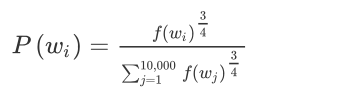

#  第五门课 序列模型(Sequence Models)

## 第一周 循环序列模型（Recurrent Neural Networks）

### 循环神经网络模型（Recurrent Neural Network Model）

使用一般神经网络处理序列问题：

一、是输入和输出数据在不同例子中可以有不同的长度，不是所有的例子都有着同样输入长度或是同样输出长度的。即使每个句子都有最大长度，也许你能够填充（**pad**）或零填充（**zero pad**）使每个输入语句都达到最大长度，但仍然看起来不是一个好的表达方式。

二、一个像这样单纯的神经网络结构，它并不共享从文本的不同位置上学到的特征。具体来说，如果神经网络已经学习到了在位置1出现的**Harry**可能是人名的一部分，那么如果**Harry**出现在其他位置，比如时，它也能够自动识别其为人名的一部分的话，这就很棒了。这可能类似于你在卷积神经网络中看到的，你希望将部分图片里学到的内容快速推广到图片的其他部分，而我们希望对序列数据也有相似的效果。和你在卷积网络中学到的类似，用一个更好的表达方式也能够让你减少模型中参数的数量。

**RNN**前向传播示意图：

把复杂的示意图拆分成多个模块组合，每个数据的激活值计算还需要其前一层的激活值。

即RNN在某一时刻的预测仅使用了从序列之前的输入信息。

前向传播的计算过程：

在t时刻：

在此基础上简化：

即把权重矩阵Waa和Wax水平压缩为一个矩阵Wa，对应的a和x也垂直何必为一个向量。

### 通过时间的反向传播（Backpropagation through time）

由前向传播得到时间t的损失为：

此处使用标准逻辑回归损失函数，也叫交叉熵损失函数（**Cross Entropy Loss**）,是关于单个位置上或者说某个时间步t上某个单词的预测值的损失函数。

因此计算出每个时刻的损失，将其加起来，得到RNN的损失函数：

RNN的反向传播如图红色线表示，与前向传播恰好相反，从右到左逐步计算。

### 不同类型的循环神经网络（Different types of **RNN**s）

### 语言模型和序列生成（Language model and sequence generation）

使用**RNN**构建一个语言模型

语言模型所做的就是，它会估计某个句子序列中各个单词出现的可能性，告诉你某个特定的句子它出现的概率是多少。

首先需要一个训练集，包含一个很大的英文文本语料库（**corpus**）或者其它的语言，你想用于构建模型的语言的语料库。语料库是自然语言处理的一个专有名词，意思就是很长的或者说数量众多的英文句子组成的文本。

然后将输入的句子标记化，建立一个字典，然后将每个单词都转换成对应的**one-hot**向量，也就是字典中的索引。可能还有一件事就是你要定义句子的结尾，一般的做法就是增加一个额外的标记，叫做**EOS**，它表示句子的结尾，这样能够帮助你搞清楚一个句子什么时候结束。

构建一个**RNN**来构建这些序列的概率模型。

### 对新序列采样（Sampling novel sequences）

训练一个序列模型之后，要想了解到这个模型学到了什么，一种非正式的方法就是进行一次新序列采样。

### 循环神经网络的梯度消失（Vanishing gradients with **RNN**s）

训练很深的神经网络时，随着层数的增加，导数有可能指数型的下降或者指数型的增加，我们可能会遇到梯度消失或者梯度爆炸的问题。

加入一个**RNN**处理1,000个时间序列的数据集或者10,000个时间序列的数据集，这就是一个1,000层或者10,000层的神经网络，这样的网络就会遇到上述类型的问题。

梯度爆炸基本上用梯度修剪就可以应对，但梯度消失比较棘手。

以两个句子为例：

**The cat, which already ate ……, was full.**

**The cats, which ate ……, were full.**

前后应该保持一致，因为**cat**是单数，所以应该用**was**。**cats**是复数，所以用**were**。

句子有长期的依赖，最前面的单词对句子后面的单词有影响,但RNN不擅长于扑捉这种依赖，某个时间步的输出只与附近的输入有关，因此**RNN**不擅长处理长期依赖的问题

### **GRU**单元（Gated Recurrent Unit（**GRU**））

使用**GRU**，门控循环单元网络，可以有效地解决梯度消失的问题，并且能够使你的神经网络捕获更长的长期依赖，它改变了**RNN**的隐藏层，使其可以更好地捕捉深层连接，并改善了梯度消失问题。

简化过的**GRU**单元

### 长短期记忆（**LSTM**（long short term memory）unit）

**LSTM**前向传播图：

 **LSTM**反向传播计算：

**门求偏导：**

**参数求偏导 ：**

最后，计算隐藏状态、记忆状态和输入的偏导数：

### 双向循环神经网络（Bidirectional **RNN**）

在序列的某点处不仅可以获取之前的信息，还可以获取未来的信息.

LSTM和GRU可理解为RNN中每一个时间步所使用的单元结构，BRNN可使用RNN/GRU/LSTM。

 

### 深层循环神经网络（Deep **RNN**s）

## 第二周 自然语言处理与词嵌入（Natural Language Processing and Word Embeddings）

将RNN、GRU和LSTM应用到NLP上。

### 词汇表征（Word Representation）

使用**one-hot**向量来表示词汇会把每个词孤立起来，这样使得算法对相关词的泛化能力不强，算法不能学习到两个类似的词之间的关系，因为使用**one-hot**向量来表示的向量任意二者之间内积的值都是一样的，都为0.

因此，使用高维特征化的表示来表示每个词，**man**，**woman**，**king**，**queen**，**apple**，**orange**或者词典里的任何一个单词。但实际的高维特征表示并不如下图这么容易理解。

使用可视化算法来把300维的特征向量，或者说300维的词嵌入，嵌入到一个二维空间里

可以看到类似的词聚合在一起。

常用的可视化算法是**t-SNE算法**，来自于**Laurens van der Maaten** 和 **Geoff Hinton**的论文。

### 使用词嵌入（Using Word Embeddings）

用词嵌入做迁移学习的步骤：

第一步，先从大量的文本集中学习词嵌入。一个非常大的文本集，或者可以下载网上预训练好的词嵌入模型。

第二步，你可以用这些词嵌入模型把它迁移到你的新的只有少量标注训练集的任务中，比如说用这个300维的词嵌入来表示你的单词。这样做的一个好处就是你可以用更低维度的特征向量代替原来的10000维的**one-hot**向量，现在你可以用一个300维更加紧凑的向量。尽管**one-hot**向量很快计算，而学到的用于词嵌入的300维的向量会更加紧凑。

第三步，当你在你新的任务上训练模型时，在你的命名实体识别任务上，只有少量的标记数据集上，你可以自己选择要不要继续微调，用新的数据调整词嵌入。

### 词嵌入的特性（Properties of Word Embeddings）

词类比推理是被**Tomas Mikolov** 和 **Wen-tau Yih**还有**Geoffrey Zweig**提出的，这是词嵌入领域影响力最为惊人和显著的成果之一，这种思想帮助了研究者们对词嵌入领域建立了更深刻的理解。

在图中，词嵌入向量在一个可能有300维的空间里。

单词**man**代表的就是空间中的一个点，另一个单词**woman**代表空间另一个点，单词**king**也代表一个点，还有单词**queen**也在另一点上（上图编号1方框内所示的点）。

事实上，我们在上个幻灯片所展示的就是向量**man**和**woman**的差值非常接近于向量**king**和**queen**之间的差值，我所画的这个箭头（上图编号2所示）代表的就是向量在**gender**（**性别**）这一维的差，不过不要忘了这些点是在300维的空间里。为了得出这样的类比推理，计算当**man**对于**woman**，那么**king**对于什么，你能做的就是找到单词**w**来使得：

即找到单词**w**来最大化：

sim是相似度函数。

最常用的相似度函数叫做余弦相似度

### 嵌入矩阵（Embedding Matrix）

假设我们的词汇表含有10,000个单词，词汇表里有**a**，**aaron**，**orange**等，我们要做的就是学习一个嵌入矩阵，它将是一个300×10,000的矩阵。

假设**orange**的单词编号是6257（下图编号1所示），代表词汇表中第6257个单词，我们用符号 O6527来表示这个**one-hot**向量，这个向量除了第6527个位置上是1（下图编号2所示），其余各处都为0，显然它是一个10,000维的列向量，它只在一个位置上有1。

假设这个嵌入矩阵叫做矩阵E，注意如果用去乘以右边的**one-hot**向量（上图编号3所示），也就是O6527，那么就会得到一个300维的向量e6527,这个符号是我们用来表示这个300×1的嵌入向量的符号，它表示的单词是**orange**.

关键是要学习矩阵E

### 学习词嵌入（Learning Word Embeddings）

假如你在构建一个语言模型，并且用神经网络来实现这个模型。于是在训练过程中，你可能想要你的神经网络能够做到比如输入：“**I want a glass of orange ___.**”，然后预测这句话的下一个词。

通过预测词前面的6个词对应的词嵌入向量作为输入，通过神经网络来进行预测。

也可选固定的历史窗口，如4。

如果你要建立一个语言模型，那么一般选取目标词之前的几个词作为上下文。但如果你的目标不是学习语言模型本身的话，那么你可以选择其他的上下文。

###  Word2Vec算法

假设在训练集中给定了一个这样的句子：“**I want a glass of orange juice to go along with my cereal.**”，在**Skip-Gram**模型中，我们要做的是抽取上下文和目标词配对，来构造一个监督学习问题。

于是：构造一个监督学习问题，它给定上下文词，要求你预测在这个词正负10个词距或者正负5个词距内随机选择的某个目标词。

构造这个监督学习问题的目标并不是想要解决这个监督学习问题本身，而是想要使用这个学习问题来学到一个好的词嵌入模型。

假设使用一个10,000词的词汇表，要解决的基本的监督学习问题是学习一种映射关系，从上下文**c**，比如单词**orange**，到某个目标词，记为**t**，可能是单词**juice**或者单词**glass**或者单词**my**。

通过softmax来预测不同目标词的概率：

但需要对你词汇表中的所有10,000个词做求和计算，计算速度很慢，需要采用一些解决方案，如分级（**hierarchical**）的**softmax**分类器和**负采样**（**Negative Sampling**）。

分级（**hierarchical**）的**softmax**分类器采用树形结构，树上内部的每一个节点都可以是一个二分类器，但不会使用一棵完美平衡的分类树或者说一棵左边和右边分支的词数相同的对称树，实际上常用词在顶部，不常用的词会在树的更深处。

这就是**Word2Vec**的**Skip-Gram**模型。

论文实际上有两个不同版本的**Word2Vec**模型，**Skip-Gram**只是其中的一个，另一个叫做**CBOW**，即连续词袋模型（**Continuous** **Bag-Of-Words Model**），它获得中间词两边的的上下文，然后用周围的词去预测中间的词，这个模型也很有效，也有一些优点和缺点。

**CBOW**是从原始语句推测目标字词；而**Skip-Gram**正好相反，是从目标字词推测出原始语句。**CBOW**对小型数据库比较合适，而**Skip-Gram**在大型语料中表现更好。 （下图左边为**CBOW**，右边为**Skip-Gram**）

**Skip-Gram**模型，关键问题在于**softmax**这个步骤的计算成本非常昂贵，因为它需要在分母里对词汇表中所有词求和。

### 负采样（Negative Sampling）

构造一个新的监督学习问题，那么问题就是给定一对单词，比如**orange**和**juice**，我们要去预测这是否是一对上下文词-目标词（**context-target**）

选择一个上下文词（上图编号2所示），再选一个目标词（上图编号3所示），这（上图编号4所示）就是表的第一行，它给了一个正样本，上下文，目标词，并给定标签为1。

再从字典中选取随机的词，并标记0，这些就会成为负样本.

学习算法输入x，输入这对词（上图编号7所示），要去预测目标的标签（上图编号8所示），即预测输出y。

负样本的个数定义为K，小数据集的话，K从5到20比较好。如果你的数据集很大，K就选的小一点。对于更大的数据集就等于2到5，数据集越小就越大。那么在这个例子中，我们就用K=4。

不使用一个巨大的10,000维度的**softmax**，因为计算成本很高，而是把它转变为10,000个二分类问题，每个都很容易计算，每次迭代我们要做的只是训练它们其中的5个，一般而言就是个K+1，其中K个负样本和1个正样本。

c代表上下文词，t代表目标词

定义一个逻辑回归模型，给定输入的c，t对的条件下，y=1的概率，即：

选取负样本：

论文的作者**Mikolov**等人根据经验，他们发现这个经验值的效果最好，它位于这两个极端的采样方法之间，既不用经验频率，也就是实际观察到的英文文本的分布，也不用均匀分布，他们采用以下方式：

进行采样，所以如果f(wi)是观测到的在语料库中的某个英文词的词频，通过3/4次方的计算，使其处于完全独立的分布和训练集的观测分布两个极端之间。

### GloVe 词向量（GloVe Word Vectors）

在**NLP**社区有着一定势头的算法是**GloVe**算法，这个算法并不如**Word2Vec**或是**Skip-Gram**模型用的多，但是也有人热衷于它.

假定Xij是单词i在单词j上下文中出现的次数，那么这里和就和和的功能一样，所以你可以认为等同于

就是一个学习词嵌入的算法，但视频不知道说什么。具体自己看论文把。

### 情感分类（Sentiment Classification）

情感分类任务就是看一段文本，然后分辨这个人是否喜欢他们在讨论的这个东西，这是**NLP**中最重要的模块之一，经常用在许多应用中。

简单的情感分类的模型

构建一个分类器，取这些向量（上图编号2所示），比如是300维度的向量。然后把它们求和或者求平均，这个单元（上图编号3所示）会得到一个300维的特征向量，把这个特征向量送进**softmax**分类器，然后输出。这个**softmax**能够输出5个可能结果的概率值，从一星到五星，这个就是5个可能输出的**softmax**结果用来预测的值。

缺点：没有考虑词序。

比如一个负面的评价，"**Completely lacking in good taste, good service, and good ambiance.**"，但是**good**这个词出现了很多次，有3个**good**，如果你用的算法跟这个一样，忽略词序，仅仅把所有单词的词嵌入加起来或者平均下来，你最后的特征向量会有很多**good**的表示，你的分类器很可能认为这是一个好的评论，尽管事实上这是一个差评，只有一星的评价。

使用**RNN**来做情感分类

一个多对一的网络结构的例子。

这样就能够意识到"**things are lacking in good taste**"，这是个负面的评价，“**not good**”也是一个负面的评价。而不像原来的算法一样，只是把所有的加在一起得到一个大的向量，根本意识不到“**not good**”和 “**good**”不是一个意思，"**lacking in good taste**"也是如此，等等。

### 词嵌入除偏（Debiasing Word Embeddings）

以性别歧视为例：

一、对于性别歧视这种情况来说，我们能做的是ehe-eshe，因为它们的性别不同，然后将emale-efemale等，然后将这些值取平均（上图编号2所示），将这些差简单地求平均，从而定义出一个偏见区域

二、中和步骤，所以对于那些定义不确切的词可以将其处理一下，避免偏见。有些词本质上就和性别有关，像**grandmother**、**grandfather**、**girl**、**boy**、**she**、**he**，他们的定义中本就含有性别的内容，不过也有一些词像**doctor**和**babysitter**我们想使之在性别方面是中立的。所以对于像**doctor**和**babysitter**这种单词我们就可以将它们在这个轴（上图编号1所示）上进行处理，来减少或是消除他们的性别歧视趋势的成分，也就是说减少他们在这个水平方向上的距离（上图编号2方框内所示的投影），所以这就是第二个中和步。

三、均衡步，意思是说你可能会有这样的词对，**grandmother**和**grandfather**，或者是**girl**和**boy**，对于这些词嵌入，你只希望性别是其区别。它主要做的就是将**grandmother**和**grandfather**移至与中间轴线等距的一对点上（上图编号2所示），现在性别歧视的影响也就是这两个词与**babysitter**的距离就完全相同了（上图编号3所示）。所以总体来说，会有许多对像**grandmother-grandfather**，**boy-girl**，**sorority-fraternity**，**girlhood-boyhood**，**sister-brother**，**niece-nephew**，**daughter-son**这样的词对，你可能想要通过均衡步来解决他们。

如何确定哪个词是中立的：

训练一个分类器来尝试解决哪些词是有明确定义的，哪些词是性别确定的，哪些词不是。结果表明英语里大部分词在性别方面上是没有明确定义的，意思就是说性别并是其定义的一部分，只有一小部分词像是**grandmother-grandfather**，**girl-boy**，**sorority-fraternity**等等，不是性别中立的。因此一个线性分类器能够告诉你哪些词能够通过中和步来预测这个偏见趋势，或将其与这个本质是**299D**的子空间进行处理。

## **第三周 序列模型和注意力机制（**Sequence models & Attention mechanism**）**

本周将学习**seq2seq**（**sequence to sequence**）模型、集束搜索（**Beam search**）和注意力模型（**Attention Model**），音频模型

### 基础模型（Basic Models）

**seq2seq**（**sequence to sequence**）模型：将法语句子翻译为英语句子。

编码网络（**encoder network**）（上图编号1所示），一个**RNN**的结构， **RNN**的单元可以是**GRU** 也可以是**LSTM**。每次只向该网络中输入一个法语单词，将输入序列接收完毕后，这个**RNN**网络会输出一个向量来代表这个输入序列。

解码网络（**decoder network**）（上图编号2所示），以编码网络的输出作为输入，每次输出一个翻译后的单词，一直到它输出序列的结尾或者句子结尾标记。

**image to sequence**模型：自动地输出图片的描述

### 选择最可能的句子（Picking the most likely sentence）

**seq2seq**机器翻译模型和语言模型之间有很多相似：

机器翻译模型的decoder network 几乎和语言模型一样，只是其输入为 经过encoder network的向量。

因此称其为条件语言模型（**conditional language model**）。

相比语言模型，输出任意句子的概率，随机地生成句子，翻译模型会输出句子的英文翻译的概率（上图编号5所示），这取决于输入的法语句子（上图编号6所示），最后需要找到最有可能的英语翻译。

由于句子组合数量过于巨大，无法一一列举，所以我们需要一种合适的搜索算法：

假如你想真正地通过模型将法语翻译成英文，通过输入的法语句子模型将会告诉你各种英文翻译所对应的可能性，从其分布中随机选择，会有好的翻译，但也会有不好的翻译。

所以当你使用这个模型来进行机器翻译时，你并不是从得到的分布中进行随机取样，而是你要找到一个英语句子（上图编号1所示），使得条件概率最大化。所以在开发机器翻译系统时，你需要做的一件事就是想出一个算法，用来找出合适的值，使得该项最大化，而解决这种问题最通用的算法就是束搜索(**Beam Search**)。

为什么不用贪心搜索(**Greedy Search**)：

贪心搜索会依次在每个时间片选出概率最高的词，但真正需要的是一次性挑选出整个单词序列，贪心搜索并不能保证最后得到的序列概率最高，贪心解不一定是最优解。

### 集束搜索（Beam Search）

集束搜索算法会有一个参数**B**，叫做集束宽（**beam width**），即每一次搜索考虑的结果数量。

集束搜索的第一步，当B=3，对第一个单词有不同选择的可能性，最后找到**in**、**jane**、**september**，是英语输出的第一个单词的最可能的三个选项。集束搜索算法会保存这些结果，然后用于下一次集束搜索。

集束搜索算法的第二步，已经选出了**in**、**jane**、**september**作为第一个单词三个最可能的选择，集束算法接下来会针对每个第一个单词考虑第二个单词是什么。

针对第一步的三个单词，第二个词有10000个可能结果，第二步得出的y2有3x10000=30000种结果，选择最可能的三个结果，集束搜索算法会保存这些结果，然后用于下一次集束搜索。

以此类推，每次增加一个单词继续，集束搜索一次只考虑3个可能结果。

### 改进集束搜索（Refinements to Beam Search）

使用乘积概率时，由于多个小于1的概率连乘，会造成数值下溢（**numerical underflow**）。数值下溢就是数值太小了，导致电脑的浮点表示不能精确地储存，因此在实践中,我们不会最大化这个乘积，而是取log值。

在取log的基础上，考虑到更少的概率连乘会得到更大的值，目标函数不自然地倾向于简短的翻译结果，因此通过除以翻译结果的单词数量（**normalize this by the number of words in your translation**）。这样就是取每个单词的概率对数值的平均了，这样很明显地减少了对输出长的结果的惩罚（**this significantly reduces the penalty for outputting longer translations.**）。

长度归一化（**Length normalization**）就是对束搜索算法稍作调整的一种方式，Ty表示待翻译的单词数量，

在其基础上加上指数𝝰，𝝰在0～1之间，使最后的值介于完全归一化和没有归一化之间

有时这个也叫作**归一化的对数似然目标函数**（**a normalized log likelihood objective**）。

### 集束搜索的误差分析（Error analysis in beam search）

束搜索算法是一种近似搜索算法（**an approximate search algorithm**），也被称作启发式搜索算法（**a heuristic search algorithm**），它不总是输出可能性最大的句子，它仅记录着**B**为前3或者10或是100种可能，因此可能发生错误。这时候就需要误差分析来检测是否束搜索算法出现了问题。

在开发集中，对应的输出为y*，但实际模型的输出为y^。

**RNN** (**循环神经网络**)实际上是个编码器和解码器（**the encoder and the decoder**），它会计算P(y|x)

1.当集束搜索计算出的y^的概率小于实际输出基于集束搜索的概率，此时便是束搜索算法实际上不能够给你一个能使P(y|x)最大化的值，即束搜索算法的问题。

2.反之，**RNN**模型出了问题

### 注意力模型（Attention Model ）

注意力这种思想（**The attention algorithm, the attention idea**）已经是深度学习中最重要的思想之一。

假定有一个输入句子，并使用双向的**RNN**，或者双向的**GRU**或者双向的**LSTM**，去计算每个词的特征。

然后只进行前向计算，在一个新的单向的RNN结构下生成翻译S。该RNN的输入为不同时间步对应的注意力权重与特征相乘之和。

计算注意力权重：

通过反向传播和梯度下降，由a到S的这个小型神经网络可以很好地告诉你y<t>应该花费多少注意力在a<t>上，且确保注意力权重加起来等于1。

这个算法的一个缺点就是它要花费三次方的时间，就是说这个算法的复杂是O(n3)的，如果你有Tx个输入单词和Ty个输出单词，于是注意力参数的总数就会是（Tx） X（ Ty）个，所以这个算法有着三次方的消耗。

### 触发字检测（Trigger Word Detection）

随着语音识别的发展，越来越多的设备可以通过你的声音来唤醒，这有时被叫做触发字检测系统（**rigger word detection systems**）。

吴说仅仅用了一张幻灯片来描述这种复杂的触发字检测系统。。

完全不明觉厉！。这描述了一个🐔啊。

